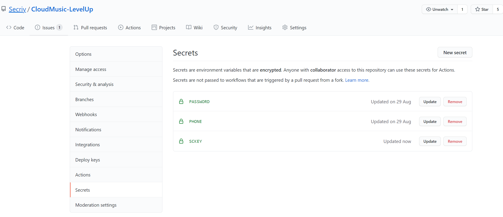
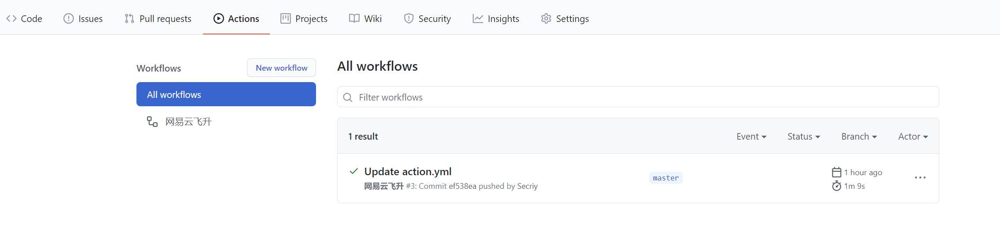
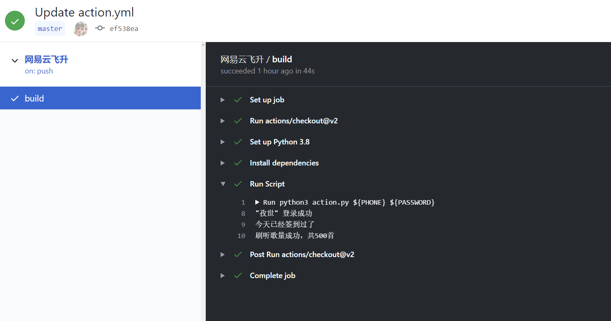
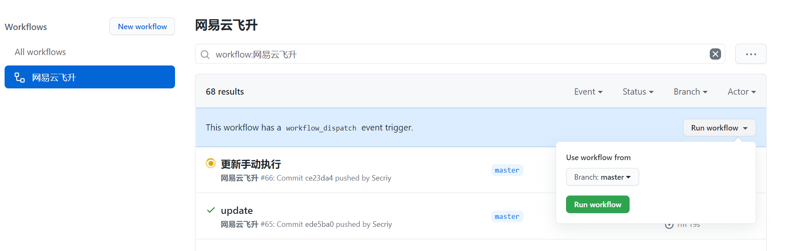

# CloudMusic-LevelUp

> 网易云音乐刷歌升级脚本
>
> [项目 GitHub 地址](https://github.com/Ysnsn/CloudMusic-LevelUp)

## 脚本功能

1. 登录网易云音乐
2. 执行签到，并显示奖励的积分数值
3. 刷音乐播放量，返回具体数值
4. 使用 GitHub Actions 挂脚本

## GitHub Actions 部署

### 1. Fork 该仓库

### 2. 创建 Secrets

- 创建 PHONE，填入手机号（必填）

- 创建 PASSWORD，填入 32 位 MD5 密码加密值（必填）

- 创建 SCKEY（Server 酱调用代码，可选）

### 3. 启用 Action

点击 Actions，选择 **I understand my workflows, go ahead and enable them**

真的是过了很久之后才发现**由于 GitHub Actions 的限制，直接 fork 来的仓库不会自动执行！！！**

必须手动修改项目提交上去，最简单的方法就是修改下图的 README.md 文件（右侧有网页端编辑按钮）。

随便修改什么都行，修改完 commit 就可以了。

之后**每天 0 点**会自动执行一次脚本

### 4. 手动执行

GitHub 现在有了手动执行的功能，点击下图 Run workflow 即可。

### 5. 多次执行（可选）

如果觉得每天刷的听歌量达不到要求，可以尝试每天多次执行的解决方案，修改 *.github/workflows/action.yml* 内的 *cron* 值为 **"0 4/16 \* \* \*"** ，即在每天的 0 点和 12 点执行。

## 注意事项

- 网易云音乐限制每天最多计算 300 首

- 必须手动修改内容，不然不会自动执行！

- 脚本使用 GitHub Actions 部署时不支持自定义歌单

- 为了方便他人学习研究，脚本保留了网易云音乐完整的表单加密算法
